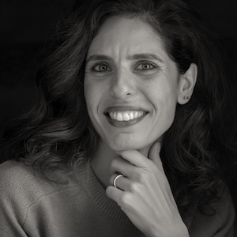

---
hide:
  - toc
  - navigation
---
<!--
CHECKLIST FOR THIS PAGE:
- [ ] Replace [YOUR NAME] with your full name (3 places)
- [ ] Replace [YOUR JOB TITLE] with your current or target role
- [ ] Replace [YOUR TAGLINE] with a short phrase describing your focus
- [ ] Rewrite the About Me paragraph with your own words
- [ ] Replace assets/images/profile.png with your actual photo (keep the filename or update it below)
- [ ] Replace assets/images/about.png with your own image (a field photo, map, or workspace shot)
- [ ] Edit the skill cards to match your actual skills (add, remove, or rename cards as needed)
- [ ] Update GitHub and LinkedIn links in the Connect section
- [ ] Add your CV PDF to docs/assets/ and update the filename in the Download CV button
-->

  
  <h1>Aida Aktas</h1>
  
<strong>Researcher - Lecturer at Istanbul Technical University</strong>

  
<em>[Turning Earth Observation Data into Agricultural Intelligence]</em>

---

## About Me

I am a researcher and lecturer working at the intersection of Earth Observation, GeoAI, and Spatial Data Science. My research focuses on developing context-aware methods that transform satellite observations and geospatial data into actionable intelligence for agriculture and environmental decision-making. I received my Ph.D. from Istanbul Technical University, where I investigated how domain knowledge and contextual information can be integrated with machine learning to improve agricultural predictions from remote sensing data.

My work combines remote sensing, artificial intelligence, and geospatial analytics to address challenges in sustainable agriculture, environmental monitoring, and digital transformation. I have contributed to research on soil moisture monitoring, crop yield estimation, phenology-based modeling, multi-source data fusion, and geospatial decision support systems using satellite, meteorological, and in-situ observations. In addition to my research activities, I teach GIS Programming and Spatial Data Science, with a particular interest in equipping students and researchers with the computational tools needed to transform complex spatial data into meaningful scientific and societal impact.

  

---

[View My Projects :material-arrow-right:](projects/index.md){ .md-button .md-button--primary }
[Download CV :material-download:](assets/AydaAktas-2024-CV.pdf){ .md-button }

---

## Skills

-   :material-layers:{ .lg .middle } **Earth Observation & Remote Sensing**

    ---

    - Optical satellite data analysis (Landsat, Sentinel-2)
    - Synthetic Aperture Radar (SAR) applications (Sentinel-1)
    - Time-series analysis and environmental monitoring
    - Vegetation, soil moisture, and crop condition assessment
    - Multi-source geospatial data integration

-   :material-code-braces:{ .lg .middle } **GeoAI & Spatial Data Science**

    ---

    - Context-aware machine learning for geospatial applications
    - Spatial and spatiotemporal data analytics
    - Environmental prediction and forecasting
    - Geospatial decision support systems

-   :material-star-four-points:{ .lg .middle } **Machine Learning & GeoAI**

    ---

    - Supervised classification — Random Forest, XGBoost
    - Deep learning for image segmentation — U-Net, SAM
    - scikit-learn, PyTorch, TensorFlow
    - Object detection in satellite imagery

-   :material-earth:{ .lg .middle } **Web Mapping & Data**

    ---

    - Leaflet.js, Folium, MapLibre GL JS
    - Cloud storage — AWS S3, Google Cloud Storage
    - Data formats — GeoTIFF, GeoParquet, NetCDF
    - Streamlit for data-driven web apps

-   :material-database:{ .lg .middle } **Data & Cloud**

    ---

    - PostgreSQL + PostGIS
    - Cloud storage: AWS S3, Google Cloud Storage
    - Data formats: GeoJSON, GeoTIFF, NetCDF, Zarr, GeoParquet

-   :material-airplane:{ .lg .middle } **Teaching & Academic Leadership**

    ---

    - GIS Programming
    - Spatial Data Science
    - Remote Sensing and Earth Observation
    - Graduate education and curriculum development
    - Research project coordination and mentoring

---

## Connect

[GitHub](https://github.com/[YOUR-GITHUB-USERNAME]){ .md-button }
[LinkedIn](https://linkedin.com/in/[YOUR-LINKEDIN-USERNAME]){ .md-button }
